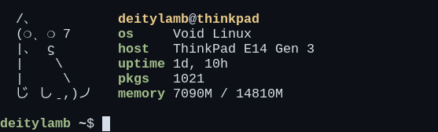

### dfetch is just my rust learning project

The main focus of this app is on **execution speed**. `(neofetch is painfully slow)`  
I'm trying to minimize the use of external libraries where the required functionality isn't complex.  
However, maintaining clean code is also a priority..  

### supports the following package managers

- xbps ( [Void Linux](https://voidlinux.org/) )
- pacman ( [Arch Linux](https://archlinux.org/) )
- emerge ( [Gentoo Linux](https://www.gentoo.org/) )

btw, i'll be happy if somebody send some cool ascii cat arts in issues :point_right::point_left:
